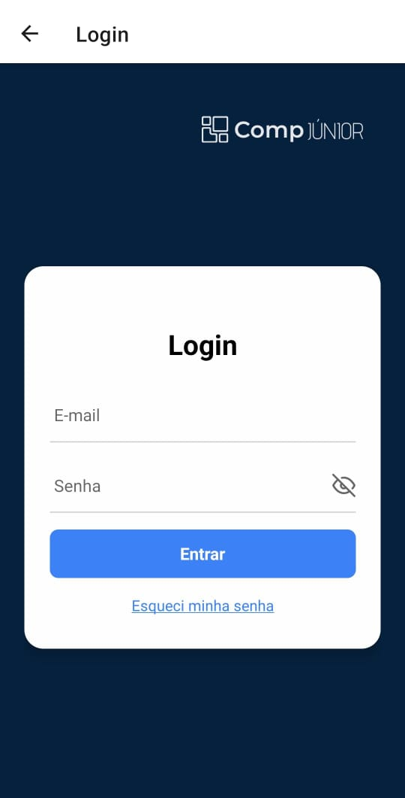
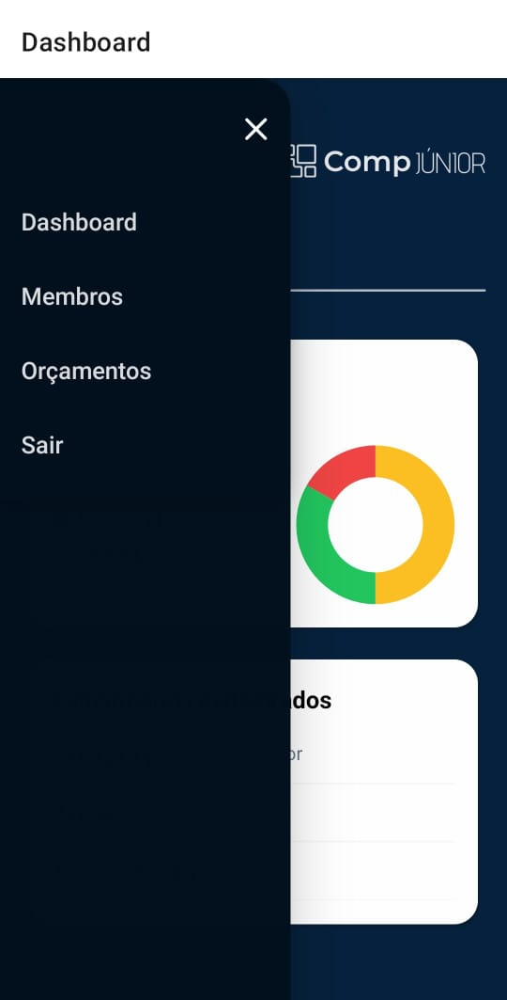
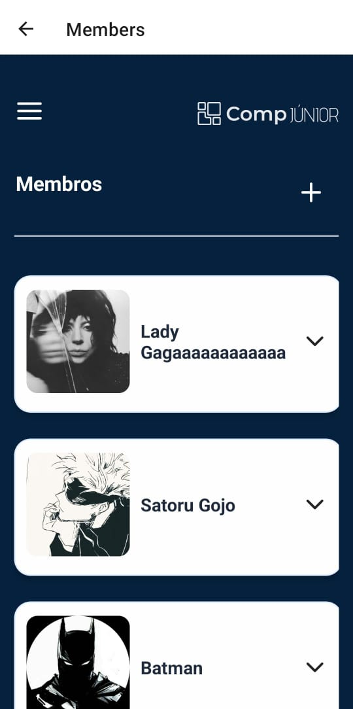
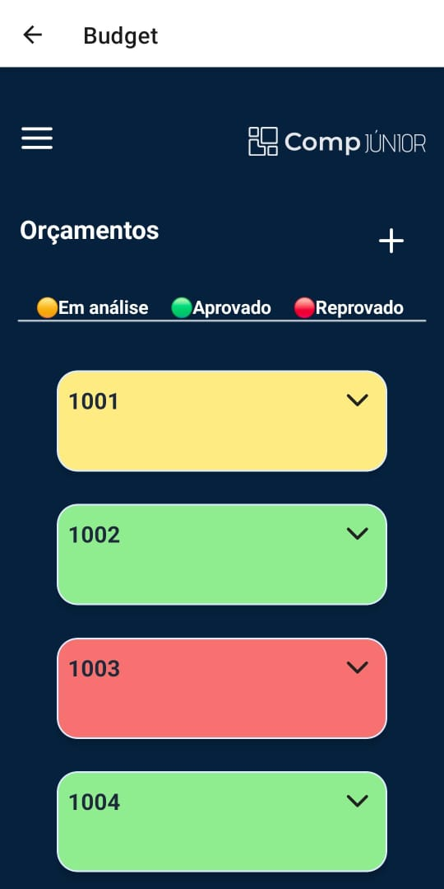

# ZEUS-APP

Aplicativo de Gestão de Membros e Orçamentos — Comp Júnior

---

## 📋 Descrição

O **ZEUS-APP** é um aplicativo mobile desenvolvido em React Native e TypeScript, com Expo, projetado para facilitar a gestão de membros e orçamentos da Comp Júnior. Com um design autoral cuidadosamente elaborado, o app oferece uma interface moderna, responsiva e acessível, garantindo uma experiência de usuário única e alinhada à identidade visual da Comp Júnior. Além disso, o aplicativo permite o controle eficiente de usuários e processos financeiros, promovendo praticidade e organização.

---

## 🚀 Tecnologias Utilizadas

- **React Native**: Framework para desenvolvimento mobile multiplataforma.
- **Expo**: Ferramenta para facilitar o desenvolvimento, build e deploy de apps React Native.
- **TypeScript**: Tipagem estática para maior segurança e produtividade.
- **React Navigation**: Navegação entre telas no app.
- **React Context API**: Gerenciamento de estado global.
- **Styled Components**: Estilização dos componentes com CSS-in-JS.
- **React Native Vector Icons**: Ícones customizáveis para React Native.
- **React Native Gesture Handler**: Gestos e interações avançadas.
- **React Native Safe Area Context**: Ajuste automático para áreas seguras de diferentes dispositivos.
- **React Native Screens**: Otimização de performance na navegação.
- **React Native Pie Chart**: Gráficos de pizza para visualização de dados.
- **Expo Image Picker**: Seleção de imagens da galeria do dispositivo.

---

## 📱 Funcionalidades Principais

1. **Autenticação de usuários:** Login, cadastro e recuperação de senha.
2. **Gerenciamento de membros:**
   - Adição, edição e remoção de membros.
   - A data de nascimento deve ser anterior à data atual (checagem automática).
   - Campos como e-mail são validados para garantir o formato correto (exemplo: x@x.x).
3. **Gerenciamento de orçamentos:**
   - Criação, edição, aprovação/reprovação e exclusão de orçamentos.
   - Novos orçamentos são automaticamente criados com o status "em análise" (amarelo) e a data atual.
4. **Confirmações de ações:**
   - Antes de realizar ações críticas, como sair do dashboard, excluir um membro, aprovar/reprovar um orçamento ou cancelar a criação de um membro ou orçamento, o usuário é solicitado a confirmar a ação.
5. **Interface responsiva:**
   - Adaptada para celulares e tablets, com sidebar ativada automaticamente em tablets.
6. **Acessibilidade aprimorada:**
   - Todos os botões e elementos interativos possuem rótulos descritivos (`accessibilityLabel`) para navegação eficiente por leitores de tela.

---

## 🛠️ Como Executar

### Pré-requisitos

- [Node.js](https://nodejs.org/en/) (versão recomendada: 20.12.2 ou superior)
- [Git](https://git-scm.com)
- [Expo CLI](https://expo.dev/) (`npm install -g expo-cli`)

> **Atenção:** Certifique-se de estar usando uma versão do Node.js compatível (preferencialmente 20.12.2 ou superior) para evitar problemas de dependências.

### Instalação e Execução

1. **Clone este repositório:**
   ```bash
   git clone <url-do-seu-repositorio>
   cd <nome-da-pasta-do-projeto>
   ```
2. **Instale as dependências:**
   ```bash
   npm install
   ```
   > Isso irá baixar todos os pacotes necessários listados no `package.json`.
3. **Inicie o projeto com o Expo:**
   ```bash
   npx expo start
   ```
4. **Abrindo o app no seu dispositivo ou emulador:**
   - **No Android:** Escaneie o QR Code exibido no terminal do Expo usando o aplicativo Expo Go.
   - **No iOS:** Escaneie o QR Code usando o app de câmera nativo do iPhone (ou o Expo Go, se preferir).
   - **No emulador Android:** Com o terminal do Expo aberto, pressione a tecla **`a`** para abrir o app automaticamente no emulador Android configurado na sua máquina.
   - **Para finalizar a execução do Expo:** Pressione **Ctrl + C** no terminal.

---

## 📁 Estrutura do Projeto

```
<zeus-app>
├── assets
├── components
├── navigation
├── screens
├── types
├── .gitignore
├── app.json
├── App.tsx
├── index.ts
├── package-lock.json
├── package.json
└── tsconfig.json
```

- **assets/**: Imagens e recursos visuais
- **components/**: Componentes reutilizáveis (botões, inputs, cards, etc.)
- **navigation/**: Configuração de rotas e navegação
- **screens/**: Telas principais do app
- **types/**: Tipagens e definições globais

---

## 📸 Telas Principais do Aplicativo

<!-- Exemplo de tela: Welcome -->

### Tela Welcome

<p align="center">
  
</p>

**Descrição:**

_Primeira tela do aplicativo._

<!-- Exemplo de tela: Login -->

### Tela Login

<p align="center">
  
</p>

**Descrição:**

_A tela de login permite que o usuário acesse o aplicativo inserindo suas credenciais. Caso tenha esquecido a senha, é possível clicar na opção "Esqueci minha senha", onde será solicitado o código enviado por e-mail (123456). Além disso, é possível fazer login utilizando os dados "Teste@zeus.com" como e-mail e "Teste" como senha._

<!-- Exemplo de tela: Dashboard -->

### Tela Dashboard

<p align="center">
  
</p>

**Descrição:**

_A tela de dashboard permite ao usuário acessar diversas funcionalidades do aplicativo. Ao clicar no ícone de menu(≡), uma sidebar será exibida (em tablets, ela já fica ativada o tempo todo), permitindo a navegação entre as outras telas. Além disso, o dashboard exibe uma lista de funcionários com suas funções e um gráfico que apresenta os status dos orçamentos (em análise, aprovados e reprovados)._

<!-- Exemplo de tela: Dashboard -->

### Tela Membros

<p align="center">
  
</p>

**Descrição:**

_A tela de membros exibe uma lista de todos os membros. Clicando na seta ao lado de um membro, é possível visualizar suas informações, editá-las ou excluí-lo. Há também a opção de adicionar um novo membro (clicando no símbolo '+')._

<!-- Exemplo de tela: Dashboard -->

### Tela Membros

<p align="center">
  
</p>

**Descrição:**

_A tela de orçamentos exibe uma lista de orçamentos identificados por números. Clicando na seta de um card, é possível acessar suas informações. Caso o card esteja amarelo (em análise), o administrador pode aprovar ou reprovar o projeto. Além disso, é possível excluir qualquer projeto a qualquer momento, editar os campos dos orçamentos existentes e criar novos orçamentos (clicando no símbolo '+'), que são, automaticamente, criados com o status "em análise" (amarelo)._

---

## ✉️ Feedback e Contato

Para fornecer feedback ou entrar em contato, sinta-se à vontade para enviar um e-mail para
caiofinocchio@outlook.com
